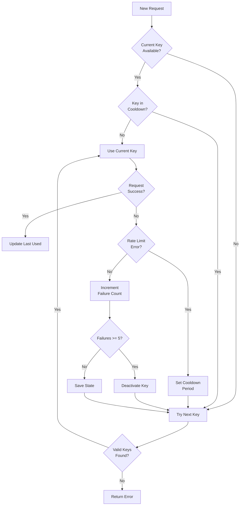
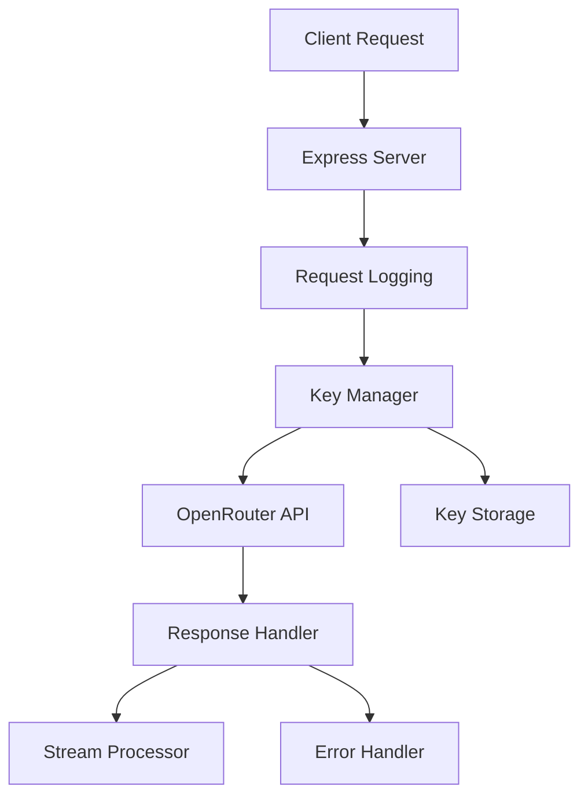

# OpenRouter Proxy Server


> A proxy server that makes OpenRouter's free models more reliable by handling API key rotation and rate limiting

## Why Use This?

When using OpenRouter's free models like DeepSeek Chat, you often encounter rate limits that can disrupt your workflow. This proxy server solves that by:

1. **Managing Multiple API Keys**: Automatically rotates between your API keys when rate limits are hit
2. **Keeping Services Running**: Tools like Aider and Roo-Code can keep working without interruption
3. **Handling Failures Gracefully**: Smart retry logic and automatic recovery from errors
4. **Being OpenAI Compatible**: Works as a drop-in replacement - just change the base URL
5. **Anthropic Compatible**: Supports `/v1/messages` endpoint for Anthropic SDK users

## Quick Start

1. **Get API Keys**: Get one or more free API keys from [OpenRouter](https://openrouter.ai)

2. **Install & Run**:
```bash
git clone https://github.com/nexon33/Openrouter-Proxy-Server
cd Openrouter-Proxy-Server
npm install
node add-key.js  # Add your API keys when prompted
node server.js
```

3. **Use with Your Tools**:
- For Aider: `aider --openai-api-base http://localhost:3000/v1`
- For Roo-Code: Update settings with base URL `http://localhost:3000/v1`
- For OpenAI SDK:
```javascript
const openai = new OpenAI({
  baseURL: 'http://localhost:3000/v1',
  apiKey: 'dummy-key'  // Real keys managed by proxy
});
```
- For Anthropic SDK:
```javascript
const anthropic = new Anthropic({
  baseURL: 'http://localhost:3000/v1',
  apiKey: 'dummy-key'  // Real keys managed by proxy
});
```

[](https://nodejs.org/)
[]()

## ✨ Features

| **Key Management** 🔑         | **Streaming** 🌊           | **Observability** 📊         | **Security** 🔒           |
|-------------------------------|---------------------------|-----------------------------|--------------------------|
| Smart API key rotation         | Full streaming support    | Comprehensive logging       | Timing-safe auth         |
| Sticky session optimization    | Automatic retry logic     | Daily log rotation          | Admin rate limiting      |
| JSON-based storage             | Connection management     | Error tracking (file + console) | Header injection protection |
| Rate limit handling            | Chunk processing          | Key status monitoring       | Abort on client disconnect |
| **Auto model ID normalization**| **Multi-modal support**   | **Error logs to file + console** | **Request validation** |

| **API Compatibility** 🔄      | **Developer Experience** 🛠 |
|-------------------------------|----------------------------|
| OpenAI `/v1/chat/completions` | Auto model ID normalization |
| Anthropic `/v1/messages`      | Request validation (OpenAI schema) |
| OpenAI `/v1/models`           | Client header forwarding |
| Tool/function calling         | Structured error responses |

## 🛠 Configuration

### Environment Variables (`.env`)

```env
# Server
PORT=3000                           # Server port (default: 3000)

# OpenRouter API Keys (comma-separated for multiple keys)
OPENROUTER_API_KEYS=sk-or-xxx,sk-or-yyy

# OpenRouter Settings
HTTP_REFERER=http://localhost:3000  # Referer header for OpenRouter
SITE_NAME=OpenRouterProxy           # Site title for OpenRouter

# Rate Limiting (general)
RATE_LIMIT_WINDOW_MS=60000          # Rate limit window in ms (default: 1 min)
RATE_LIMIT_MAX=100                  # Max requests per window (default: 100)

# Admin Rate Limiting (stricter)
ADMIN_RATE_LIMIT_WINDOW_MS=60000    # Admin rate limit window in ms (default: 1 min)
ADMIN_RATE_LIMIT_MAX=10             # Max admin requests per window (default: 10)

# Request Limits
BODY_LIMIT=5mb                      # Max request body size (default: 5mb)
MAX_MESSAGE_LENGTH=100000           # Max characters per message (default: 100k)
SSE_BUFFER_LIMIT=10485760           # SSE buffer limit in bytes (default: 10MB)

# Retry Settings
MAX_RETRIES=3                       # Max retry attempts (default: 3)
RETRY_DELAY_MS=1000                 # Delay between retries in ms (default: 1000)

# Timeouts
AXIOS_TIMEOUT=120000                # Upstream request timeout in ms (default: 120s)
MODELS_TIMEOUT=30000                # Models endpoint timeout in ms (default: 30s)
AXIOS_MAX_SOCKETS=50                # Max concurrent sockets (default: 50)
AXIOS_MAX_FREE_SOCKETS=10           # Max free sockets (default: 10)
AXIOS_KEEPALIVE_TIMEOUT=60000       # Keep-alive timeout in ms (default: 60s)
AXIOS_FREE_SOCKET_TIMEOUT=30000     # Free socket timeout in ms (default: 30s)

# Key Manager
KEY_MAX_ROTATION_DEPTH=2            # Max key rotation recursion depth (default: 2)
KEY_MAX_FAILURE_COUNT=5             # Max failures before key deactivation (default: 5)
KEY_REACTIVATION_FAILURE_REDUCTION=2 # Failure reduction on bulk reactivation (default: 2)

# Logging
LOG_LEVEL=warning                   # Global log level (error|warning|info|debug)
LOG_RETENTION_DAYS=14               # Log retention in days (default: 14)
```

### Adding API Keys

```bash
node add-key.js
```

Or programmatically via admin API:
```bash
curl -X POST http://localhost:3000/admin/keys \
  -H "Content-Type: application/json" \
  -H "X-Admin-Secret: your-admin-secret" \
  -d '{"key": "sk-or-your-api-key"}'
```

### Starting the Server

```bash
node server.js
```

On startup, the server automatically fetches the model list from OpenRouter and builds the model ID normalization mapping. This happens in parallel with key initialization.

## 🚀 Usage Examples

### JavaScript Client (OpenAI)
```javascript
const openai = new OpenAI({
  baseURL: 'http://localhost:3000/v1',
  apiKey: 'dummy-key' // Actual key managed by proxy
});

// Streaming response
const stream = await openai.chat.completions.create({
  model: 'deepseek/deepseek-chat:free',
  messages: [{ role: 'user', content: 'Hello' }],
  stream: true
});

for await (const chunk of stream) {
  process.stdout.write(chunk.choices[0]?.delta?.content || '');
}
```

### JavaScript Client (Anthropic)
```javascript
const anthropic = new Anthropic({
  baseURL: 'http://localhost:3000/v1',
  apiKey: 'dummy-key' // Actual key managed by proxy
});

const message = await anthropic.messages.create({
  model: 'deepseek/deepseek-chat:free',
  max_tokens: 1024,
  messages: [{ role: 'user', content: 'Hello' }],
});
```

### cURL Example (OpenAI)
```bash
curl -X POST http://localhost:3000/v1/chat/completions \
  -H "Content-Type: application/json" \
  -H "Authorization: Bearer dummy-key" \
  -d '{
    "model": "deepseek/deepseek-chat:free",
    "messages": [{"role": "user", "content": "Hello"}]
  }'
```

### cURL Example (Anthropic)
```bash
curl -X POST http://localhost:3000/v1/messages \
  -H "Content-Type: application/json" \
  -H "Authorization: Bearer dummy-key" \
  -d '{
    "model": "deepseek/deepseek-chat:free",
    "max_tokens": 1024,
    "messages": [{"role": "user", "content": "Hello"}]
  }'
```

### Tool/Function Calling Example
```javascript
const openai = new OpenAI({
  baseURL: 'http://localhost:3000/v1',
  apiKey: 'dummy-key'
});

const response = await openai.chat.completions.create({
  model: 'deepseek/deepseek-chat:free',
  messages: [{ role: 'user', content: 'What is the weather in San Francisco?' }],
  tools: [{
    type: 'function',
    function: {
      name: 'get_weather',
      description: 'Get current weather',
      parameters: {
        type: 'object',
        properties: {
          location: { type: 'string', description: 'City name' }
        },
        required: ['location']
      }
    }
  }],
  tool_choice: 'auto'
});
```

### Multi-Modal (Image) Example
```javascript
const openai = new OpenAI({
  baseURL: 'http://localhost:3000/v1',
  apiKey: 'dummy-key'
});

const response = await openai.chat.completions.create({
  model: 'google/gemini-pro-vision',
  messages: [{
    role: 'user',
    content: [
      { type: 'text', text: 'What is in this image?' },
      { type: 'image_url', image_url: { url: 'https://example.com/image.jpg' } }
    ]
  }]
});
```

## 🔄 Key Rotation Strategy



The key rotation system implements:

- **Sticky Sessions**: Uses same key for consecutive requests when possible
- **Smart Cooldown**: Rate-limited keys enter cooldown based on rate limit headers
- **Failure Tracking**: Keys are deactivated after 5 consecutive failures
- **Age-based Selection**: Rotates to least recently used available key
- **Automatic Recovery**: Keys automatically reactivate after cooldown period
- **Key Reactivation**: Deactivated keys can be re-added through admin API
- **Thread-Safe Mutex**: Uses promise-based mutex to prevent race conditions during rotation
- **Graceful Reactivation**: Bulk key reactivation with graduated failure reduction

## 🤖 Auto Model ID Normalization

On startup, the server automatically fetches the model list from OpenRouter and builds a dynamic mapping from OpenRouter model IDs to OpenAI-compatible format:

| OpenRouter ID | Normalized |
|---------------|------------|
| `openai/gpt-4o` | `gpt-4o` |
| `anthropic/claude-3.5-sonnet` | `claude-3.5-sonnet` |
| `meta-llama/llama-3.1-405b` | `llama-3.1-405b` |
| `deepseek/deepseek-chat:free` | `deepseek-chat` |
| `new-provider/new-model` | `new-model` (auto) |

**Benefits:**
- **Zero maintenance** - New models automatically supported
- **Provider-agnostic** - Works for any provider
- **Auto-removes `:free`** suffix
- **Handles edge cases** via minimal fallback map
- **Cached in memory** - Fast lookups after startup
- **Self-updates** on every server restart

The `/v1/models` endpoint returns normalized model IDs in OpenAI format.

## 🔒 Security Features

- **Timing-Safe Comparison**: Admin secret uses `crypto.timingSafeEqual()` with length validation
- **Header Injection Protection**: All header values sanitized (newlines stripped, length limited)
- **Admin Rate Limiting**: Dedicated stricter rate limiter (10 req/min) for admin endpoints
- **Input Validation**: Message length limits, request body size limits, SSE buffer limits
- **Request Sanitization**: Automatic redaction of sensitive fields in logs
- **Abort on Disconnect**: Upstream requests cancelled when client disconnects
- **Security Headers**: X-Content-Type-Options, X-Frame-Options, X-XSS-Protection, Referrer-Policy
- **Request Validation**: Full OpenAI Chat Completions schema validation

## 📊 Observability

### Logging
- `logs/requests-%DATE%.log`: Request/response details (sanitized)
- `logs/errors-%DATE%.log`: Error stack traces with context
- `logs/keys-%DATE%.log`: Key rotation events
- `logs/streams-%DATE%.log`: Stream chunk logs (debug level)

**Error logs go to BOTH file and console** - Critical errors are always visible in console regardless of log level setting.

### Log Levels
- **error**: Errors and critical issues (always in console + file)
- **warning**: Important events (default)
- **info**: Key events, successes
- **debug**: Stream chunks, detailed tracing

### Health Checks
- `GET /health` - Returns `ready`/`not ready` status
- `GET /v1/models` - Models endpoint with retry logic

## 📚 Documentation

### API Reference

#### Chat Completions (OpenAI)
`POST /v1/chat/completions`
- OpenAI-compatible chat completions endpoint
- Supports both streaming and non-streaming responses
- Auto-retries on rate limits (max 3 attempts)
- Full request validation (OpenAI schema)
- Tool/function calling support
- Multi-modal (image) support
- Headers:
  - `Content-Type: application/json`
  - `Authorization: Bearer dummy-key` (actual key managed by proxy)
  - `X-Request-ID`: Added for distributed tracing
  - `HTTP-Referer`, `X-Title`: Forwarded from client if provided

#### Messages (Anthropic)
`POST /v1/messages`
- Anthropic-compatible messages endpoint
- Translates Anthropic format → OpenAI → OpenRouter → Anthropic
- Supports system parameter, tool use, streaming
- Auto-retries on rate limits (max 3 attempts)
- Headers:
  - `Content-Type: application/json`
  - `Authorization: Bearer dummy-key` (actual key managed by proxy)
  - `X-Request-ID`: Added for distributed tracing

#### Models List
`GET /v1/models`
- Retrieves available models from OpenRouter
- Auto-retries on rate limits (max 3 attempts)
- Returns normalized model IDs in OpenAI format
- Headers:
  - `Authorization: Bearer dummy-key`

#### Admin API
`POST /admin/keys`
- Adds new API keys to the rotation pool
- Body: `{ "key": "your-openrouter-api-key" }`
- Requires `X-Admin-Secret` header
- Protected by dedicated admin rate limiter (10 req/min)

### Architecture

#### Component Overview


#### Key Components

1. **Express Server** (`server.js`)
   - Handles HTTP routing
   - Manages request/response lifecycle
   - Implements error middleware
   - Centralized configuration via `CONFIG` object

2. **Key Manager** (`services/KeyManager.js`)
   - Maintains key rotation logic
   - Tracks key health and status
   - Implements cooldown periods
   - Thread-safe mutex for rotation
   - Centralized NVIDIA rate limit detection

3. **Logging System** (`services/logger.js`)
   - Request logging middleware
   - Error tracking (file + console)
   - Key event monitoring
   - Stream chunk logging (debug level)
   - Explicit Winston transports per category
   - Dedicated error console transport

4. **Stream Handler** (`server.js` - `handleStreamingResponse`)
   - Manages SSE connections
   - Processes stream chunks incrementally
   - Buffer overflow protection (10MB buffer, 1MB per event)
   - Client disconnect handling with AbortController
   - Optimized SSE parser using `indexOf` instead of `split`

5. **Key Storage** (`models/ApiKey.js`)
   - JSON-based file storage
   - Atomic writes with temp file + rename
   - File-lock mutex with 30s timeout
   - Empty query returns all keys (fixed bug)

6. **Sanitization** (`services/utils/sanitize.js`)
   - Recursive redaction of sensitive fields
   - Structured clone with fallback
   - Specific sensitive key patterns (not generic 'key')

#### Design Principles
- Separation of concerns
- Automatic recovery
- Comprehensive logging
- Efficient key utilization
- Graceful error handling
- Thread-safe operations
- Resource cleanup on disconnect

## 🐛 Troubleshooting

### Common Issues

#### 1. **Rate Limits**
- Symptom: 429 status code
- Solution: System automatically rotates keys and retries
- Prevention: Add more API keys or increase request intervals

#### 2. **Streaming Disconnections**
- Symptom: Stream ends unexpectedly
- Solution: 
  - Check network stability
  - Use non-streaming mode for unreliable connections
  - Implement client-side retry logic

#### 3. **No Available Keys**
- Symptom: "No available API keys" error
- Solution:
  - Add new keys via admin API
  - Wait for cooldown period to end
  - Check key status in logs

#### 4. **High Latency**
- Symptom: Slow response times
- Solution:
  - Add more API keys to rotation pool
  - Monitor network conditions
  - Consider server location relative to API

#### 5. **Buffer Overflow**
- Symptom: "SSE buffer exceeded maximum size" error
- Solution:
  - Increase `SSE_BUFFER_LIMIT` environment variable
  - Check for unusually large responses from upstream
  - Consider non-streaming mode for large responses

### Logs Location
- `logs/requests-%DATE%.log`: Request/response details
- `logs/errors-%DATE%.log`: Error stack traces (also in console)
- `logs/keys-%DATE%.log`: Key rotation events
- `logs/streams-%DATE%.log`: Stream chunk logs

## 🧪 Testing & Quality

The codebase has been through multiple rounds of automated code review using the Council Code Review skill, which identified and fixed:

### Critical Bugs Fixed
- Race condition in key rotation mutex
- Unbounded SSE buffer growth
- Timing attack on admin secret
- Double key initialization race
- Streaming double-end on rate limits
- File storage concurrency issues
- Missing client disconnect handling

### Security Issues Fixed
- Plaintext key storage (documented for future encryption)
- Admin endpoint rate limiting
- Header injection prevention
- CSP header removal for API-only service
- Logging sanitization improvements

### Performance Improvements
- Optimized SSE parser (incremental `indexOf` instead of `split`)
- Streaming logs at debug level
- AbortController for upstream cancellation
- Named constants replacing magic numbers
- Explicit Winston transports
- **Error logs to both file and console**

### Edge Cases Handled
- Client disconnect aborts upstream
- Buffer overflow clean error handling
- Stream data sent flag prevents duplicate retries
- Proper exit codes on failure
- Automated model ID normalization

## 📜 License
MIT © Adrian Belmans - See [LICENSE](LICENSE) for details